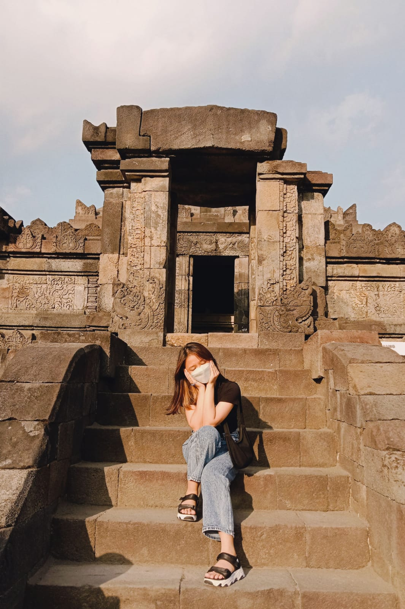

# Profile_Marcelia
Membuat Portofolio
<html>
<head >
<title>My Profile </title>
<link rel="stylesheet" href="tampilan2.css">
</head>
<body background = "gambar1.JPG">

    <a href="tampilanAwal.html">HOME</a>
    <a href="#1" class="button">Profil</a>
    <a href="#2" class="button">Pendidikan</a>
    <a href="#3" class="button">Organiasasi</a>
    <a href="#4" class="button">Keahlian</a>
    <a href="#5" class="button">Kontak</a>
      

<h1 align="center">My Profile</h1>
<table align="center" border="1">
    <tr><td colspan="2" ></td></tr>
</table>

<h2 id="1">PROFILE</h2>
<table align="center">
    <tr>
        <td width="1%">Nama</td>
        <td width="10%">: Marcelia Putri Supriosa </td>
    </tr>
    <tr>
        <td width="2%">Tempat Lahir</td>
        <td width="10%">: Palangka Raya</td>
    </tr>
    <tr>
        <td width="1%">Tanggal Lahir</td>
        <td width="10%">: 31 Juli 2002</td>
    </tr>
    <tr>
        <td width="1%">Umur</td>
        <td width="10%">: 20 Tahun</td>
    </tr>
    <tr>
        <td width="1%">Alamat</td>
        <td width="10%">: Paingan </td>
    </tr>
</table>

<h2 id="2">PENDIDIKAN</h2>
    <table border="1" >    
        <tr>
            <th>SEKOLAH</th>
            <th>TAHUN</th>
        </tr>
        <tr>
            <td>SDN 1 Kandui</td>
            <td>2007-2014</td>
        </tr>
        <tr>
            <td>SMPN 1 Kandui</td>
            <td>2014-2017</td>
        </tr>
        <tr>
            <td>SMAN 1 Kandui</td>
            <td>20017-2020</td>
        </tr>
        <tr>
            <td>UNIVERSITAS SANATA DHARMA</td>
            <td>2020-SEKARANG</td>
        </tr>
    </table>

<h2 id="3">ORGANISASI</h2>
    <table border="1" >    
        <tr>
            <th>ORGANISASI</th>
            <th>TAHUN</th>
        </tr>
        <tr>
            <td>HIMPUNAN MAHASISWA INFORMATIKA</td>
            <td>2020-2021</td>
        </tr>
        <tr>
            <td>BEM FAKULTAS SAINS DAN TEKNOLOGI</td>
            <td>2021-SEKARANG</td>
    </table>  
    
<h2 id="4">KEAHLIAN</h2>
<table align="center">
    <ul>
        <li>Kepemimpinan</li>
        <li>Kolaborasi</li>
        <li>Produktivitas</li>
        <li>Manajemen Waktu</li>
    </ul>
</table>

<h2 id="5">KONTAK</h2>
<table align="center">
    <tr>
        <td width="1%">Instagran </td>
        <td width="10%">: <a href="https://www.instagram.com/marceliap_/" >marceliap_</a></td>
    </tr>
    <tr>
        <td width="1%">Email</td>
        <td width="10%">: marcelia.supriosa02@gmail.com </td>
    </tr>
    <tr>
        <td width="1%">Github</td>
        <td width="10%">: <a href= "https://github.com/Marcelia02/Membuat_portofolio/edit/main/README.md" >Marcelia02</a></td>
    </tr>
</table>

<footer>
    

    
    <b>Copyright&copy; 2022</b> Platform A

</footer>
</body> 
</html>
